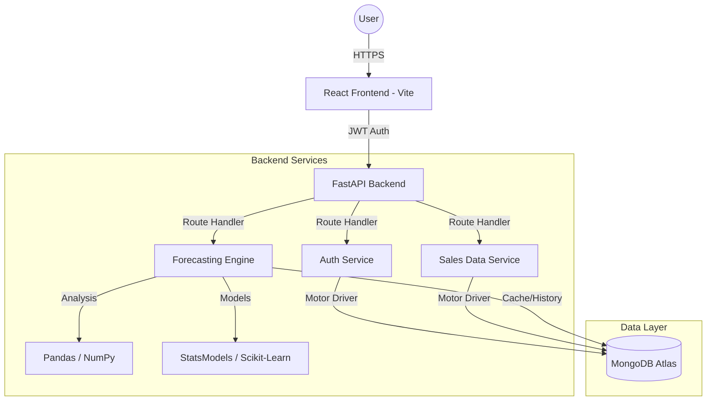

# 📈 Product Requirements Document (PRD): Trendcast

**Project Name**: Trendcast  
**Tagline**: Intelligent Sales Forecasting & Analytics Dashboard  
**Version**: 1.2.0 (Unified Specification)  
**Status**: Final  
**Owner**: Hemanth  
**Date**: April 20, 2026

---

## Table of Contents
1.  [Executive Summary](#1-executive-summary)
2.  [Product Vision & Strategy](#2-product-vision--strategy)
3.  [Target Audience & User Personas](#3-target-audience--user-personas)
4.  [User Journeys & Experience Mapping](#4-user-journeys--experience-mapping)
5.  [Functional Requirements (Deep Dive)](#5-functional-requirements-deep-dive)
6.  [Technical Architecture & Engineering](#6-technical-architecture--engineering)
7.  [Data Pipeline & Analysis Methodology](#7-data-pipeline--analysis-methodology)
8.  [API Documentation (RESTful Specification)](#8-api-documentation-restful-specification)
9.  [Security & Data Protection Strategy](#9-security--data-protection-strategy)
10. [UI/UX Design System & Aesthetics](#10-uiux-design-system--aesthetics)
11. [Non-Functional Requirements (Performance & Scalability)](#11-non-functional-requirements)
12. [Roadmap & Future Innovation](#12-roadmap--future-innovation)
13. [Risk Management & Mitigation](#13-risk-management--mitigation)
14. [Appendix & Technical Glossary](#14-appendix--technical-glossary)

---

## 1. Executive Summary

### 1.1 Overview
Trendcast is a high-performance, enterprise-grade sales forecasting and analytics platform. It is engineered to transform fragmented, raw historical sales data into a coherent, visual, and predictive narrative. By integrating cutting-edge statistical models with a modern, responsive web stack, Trendcast provides a "single pane of glass" for business intelligence.

### 1.2 The Core Problem
In the modern retail and SaaS landscape, data is abundant but insights are scarce. Stakeholders are often forced to choose between simplistic, inaccurate spreadsheets or expensive, "black-box" enterprise solutions that require a Ph.D. to operate. This gap leads to inefficient inventory management, missed revenue opportunities, and reactive rather than proactive business strategies.

### 1.3 The Trendcast Solution
Trendcast democratizes data science. It provides a robust backend (FastAPI) capable of processing large datasets, a flexible storage engine (MongoDB), and an interactive frontend (React) that visualizes forecasts using professional-grade charting libraries. The system automatically selects the best forecasting model (SARIMA vs. Exponential Smoothing) based on data volume and quality, ensuring high-fidelity predictions for users of all technical levels.

---

## 2. Product Vision & Strategy

### 2.1 Vision Statement
To be the global standard for accessible predictive analytics, enabling every organization to anticipate market shifts with mathematical precision and aesthetic clarity.

### 2.2 Strategic Pillars
- **Democratization**: Remove the barrier of entry for sophisticated time-series forecasting.
- **Visual Excellence**: Use premium design to make data exploration engaging and intuitive.
- **Operational Efficiency**: Automate the data cleaning and model selection pipeline.
- **Security by Design**: Implement industry-standard protection at every layer of the stack.

### 2.3 Competitive Advantage
- **FastAPI Backend**: High-performance, asynchronous API execution with sub-second latency for complex queries.
- **MongoDB Flexibility**: Schema-less data storage allowing for diverse and evolving dataset structures without downtime.
- **Integrated Auth**: Built-in, high-security JWT system without reliance on third-party providers.
- **Framer Motion UI**: Superior aesthetics and smooth micro-interactions that elevate the enterprise experience.

---

## 3. Target Audience & User Personas

### 3.1 Persona 1: The Analytical Specialist (Sarah)
- **Background**: Master's in Business Analytics; uses Excel and Python daily.
- **Goals**: Verify model accuracy, export cleaned data for further reporting, and analyze error metrics.
- **Frustrations**: Tedious manual data cleaning; lack of a visual platform to share results with stakeholders.

### 3.2 Persona 2: The Operational Manager (Mike)
- **Background**: 10 years in retail management; focuses on inventory, KPIs, and staffing.
- **Goals**: Predict next month's sales to optimize stock levels and prevent stock-outs.
- **Frustrations**: Overly complex software; reports that are outdated by the time they reach the floor.

### 3.3 Persona 3: The Strategic Executive (David)
- **Background**: MBA; focused on long-term growth, budgeting, and market trends.
- **Goals**: Identify seasonal patterns and multi-year growth opportunities.
- **Frustrations**: Fragmented reports; lack of a high-level, mobile-accessible predictive view.

---

## 4. User Journeys & Experience Mapping

### 4.1 Onboarding & Authentication
1.  **Landing**: User arrives at the Landing Page, viewing animations and value propositions.
2.  **Registration**: User clicks "Get Started", opens the **Auth Modal**, and creates an account (Bcrypt hashed).
3.  **Entry**: User logs in, receives a secure **JWT token**, and is redirected to the dashboard.

### 4.2 Data Ingestion & Refinement
1.  **Upload**: User drags and drops a CSV/Excel file (e.g., Walmart Sales Dataset).
2.  **Processing**: The backend validates schema, cleans dates, and stores records in **MongoDB**.
3.  **Exploration**: User interacts with the data table, performing inline CRUD operations to refine the dataset.

### 4.3 Predictive Analysis Cycle
1.  **Configuration**: User selects the target column, forecast horizon, and model type.
2.  **Execution**: System runs **SARIMA** or fallback models asynchronously.
3.  **Visualization**: User analyzes the results on an interactive chart, zooming in on the forecast delta.
4.  **Action**: User exports the forecast or uses metrics (Accuracy, RMSE) to justify business decisions.

---

## 5. Functional Requirements (Deep Dive)

### 5.1 Security & Access Control
- **REQ-1.1**: Secure registration with email validation and password complexity rules.
- **REQ-1.2**: JWT-based stateless authentication with configurable expiration.
- **REQ-1.3**: Ownership-based data isolation (Users can only see their own uploads/forecasts).
- **REQ-1.4**: Password hashing using **Bcrypt** with a minimum salt factor of 12.

### 5.2 Data Orchestration & Management
- **REQ-2.1**: Support for CSV and XLSX file ingestion.
- **REQ-2.2**: Automated handling of missing values (NaN) and date normalization.
- **REQ-2.3**: Real-time CRUD (Create, Read, Update, Delete) on individual sales records.
- **REQ-2.4**: Data export in standard CSV format for external reporting.

### 5.3 Forecasting Engine Capabilities
- **REQ-3.1**: Implementation of **SARIMA** for seasonal time-series.
- **REQ-3.2**: Fallback to **Holt-Winters Exponential Smoothing** for small or non-seasonal datasets.
- **REQ-3.3**: Calculation of exhaustive metrics: MAE, RMSE, $R^2$, and Accuracy %.
- **REQ-3.4**: Grouped forecasting (e.g., breakdown by Store or Department).

### 5.4 Advanced Visualizations & UI
- **REQ-4.1**: Interactive time-series charts with zoom, pan, and reset capabilities.
- **REQ-4.2**: Dynamic data tables with global search and pagination.
- **REQ-4.3**: Glassmorphic KPI cards for executive overview.
- **REQ-4.4**: Support for both Line and Bar chart representations of forecasted data.

---

## 6. Technical Architecture & Engineering

### 6.1 The Stack
- **Frontend**: React 19 + Vite + Tailwind CSS + Framer Motion.
- **Backend**: FastAPI (Python 3.12+) + Pydantic.
- **Database**: MongoDB (Motor Async Driver).
- **Data Science**: Pandas, Scikit-learn, Statsmodels.

### 6.2 Architecture Diagram

---

## 7. Data Pipeline & Analysis Methodology

### 7.1 Data Cleaning Logic
The pipeline performs several critical transformations:
1.  **Date Normalization**: Ambiguous date formats are coerced using `dayfirst=True`.
2.  **Aggregation**: Data is resampled to a daily frequency (`D`), filling gaps with zeros.
3.  **Validation**: Missing target values are dropped to prevent model skew.

### 7.2 Model Selection Heuristics
- **Condition A (Large Dataset)**: If N > 14 and seasonal patterns are detected, use **SARIMAX**.
- **Condition B (Small Dataset)**: If N <= 14, use a simplified **ARIMA**.
- **Condition C (Statistical Failure)**: Fallback to **Exponential Smoothing** with additive trend and seasonality.

---

## 8. API Documentation (RESTful Specification)

| Method | Endpoint | Description | Auth |
|--------|----------|-------------|------|
| `POST` | `/api/auth/register` | User Signup | No |
| `POST` | `/api/auth/login` | User Authentication | No |
| `GET` | `/api/auth/me` | Current User Info | Yes |
| `POST` | `/api/sales/upload` | CSV/Excel Upload | Yes |
| `GET` | `/api/sales` | List User Datasets | Yes |
| `POST` | `/api/forecasts/generate`| Run Forecasting Model| Yes |
| `DELETE`| `/api/sales/{id}` | Delete Dataset | Yes |

---

## 9. Security & Data Protection Strategy

Trendcast employs a **Defense-in-Depth** strategy:
- **Application Layer**: Pydantic models for strict type checking.
- **Network Layer**: CORS policies restricted to trusted domains.
- **Identity Layer**: JWTs signed with `HS256` and secured via environment-stored secrets.

---

## 10. UI/UX Design System & Aesthetics

### 10.1 Visual Language
- **Colors**: Deep zinc (#09090b) with cyan (#06b6d4) and pink (#ec4899) accents.
- **Typography**: Inter / Outfit for modern readability.
- **Aesthetics**: Glassmorphism (blur: 10px, opacity: 0.4).

### 10. interaction Design
- **Micro-interactions**: Subtle button scaling (0.95x) and smooth transitions.
- **Feedback Loops**: Real-time toasts for every system event.

---

## 11. Non-Functional Requirements

- **Scalability**: Handles 100,000+ records per dataset asynchronously.
- **Reliability**: 99.9% uptime target via stateless architecture.
- **Performance**: Dashboard load < 500ms; Forecast generation < 3s.

---

## 12. Roadmap & Future Innovation

- **Phase 2 (Q4 2026)**: LLM Integration for automated text-based insights.
- **Phase 3 (Q1 2027)**: Real-time streaming via WebSockets.
- **Phase 4 (Q2 2027)**: Native Mobile Apps (React Native).

---

## 13. Risk Management & Mitigation

| Risk | Impact | Mitigation Strategy |
|------|--------|---------------------|
| Model Overfitting | Medium | Use cross-validation and provide accuracy metrics. |
| Data Privacy Breach | High | Strict JWT enforcement and encrypted DB connections. |
| Poor Data Quality | High | Implement robust validation on ingestion. |

---

## 14. Appendix & Technical Glossary

- **SARIMA**: Seasonal Auto-Regressive Integrated Moving Average.
- **JWT**: JSON Web Token.
- **Motor**: Asynchronous Python driver for MongoDB.

---
*End of Document*
